# Digital Twin for the Evaluation of Experimental Gully Biocontrol

[](./LICENSE) 
[](https://doi.org/10.5281/zenodo.21760023)
### Morning Glory (*Ipomoea* spp. / *Ipomoea carnea*) — Bomo Gully, Zaria, Nigeria

**Author:** Naziru Halilu

## Table of Contents

- [Overview](#overview)
- [Contents](#contents)
- [Figures](#figures)
- [How to Run the Code](#how-to-run-the-code)
- [Loading a trained model](#loading-a-trained-model)
- [Key findings](#key-findings)
- [License](#license)
- [Author](#author)
- [Citation](#citation)
- [Related work](#related-work)

## Overview

This repository presents a Bayesian-grounded digital-twin framework for evaluating
Morning Glory (*Ipomoea* spp.) as a gully-erosion biocontrol measure. The framework
combines a continuous, physically consistent digital-twin simulation with real
field-measured data, two trained deep-learning models, and formal statistical
significance testing, supported by a complete, reproducible code and data pipeline.

The manuscript (35 pages, 14 figures, 10 tables, 16 equations) documents the full
methodology across hydrological, hydraulic, vegetation, geotechnical, Bayesian,
machine-learning, and statistical components of the framework.

## Contents

- `01_Manuscript/` — the complete manuscript (`.docx` and `.pdf`).
- `02_Code/` — the full reproducible pipeline:
  - `00_real_thesis_data.py` — transcribes the real field-data tables.
  - `01_generate_data.py` — generates the continuous digital-twin dataset.
  - `01b_statistical_tests.py` — runs the Wilcoxon signed-rank and paired-t-test
    analysis on the real field data.
  - `02_generate_figures.py` — builds the generated figures (300 dpi).
  - `03_train_deep_learning_model.py` — trains the real-data sediment/velocity models.
  - `04_train_dl_nowcasting_model.py` — trains the discharge-nowcasting model.
- `03_Data/` — the continuous digital-twin datasets (hydrology, DEM-of-Difference
  grid, machine-learning training set, scenario simulations, and related outputs).
- `04_Figures/` — all 14 manuscript figures, extracted directly from the
  manuscript.
- `05_Source_Images/` — the site location map, field photographs, the two
  verified real-field intervention plates used in Figure 2, and an annotated
  photo montage of the deployed field instrumentation and sensor array.
- `06_Data_Real_Field/` — the real field-measurement tables, the consolidated
  dataset, the statistical test results, the deep-learning training records, and
  the photo-verification method (`PHOTO_VERIFICATION_METHOD.md`).
- `07_Trained_Models/` — the trained model files (`.joblib`), fitted scalers, and
  the expected input feature order (`feature_columns.txt`).
- `08_BGDT_Software/` — the packaged BGDT (Bayesian-Grounded Digital Twin) software
  library, with its own module-level documentation.

## Figures

All 14 manuscript figures, extracted directly from the manuscript:

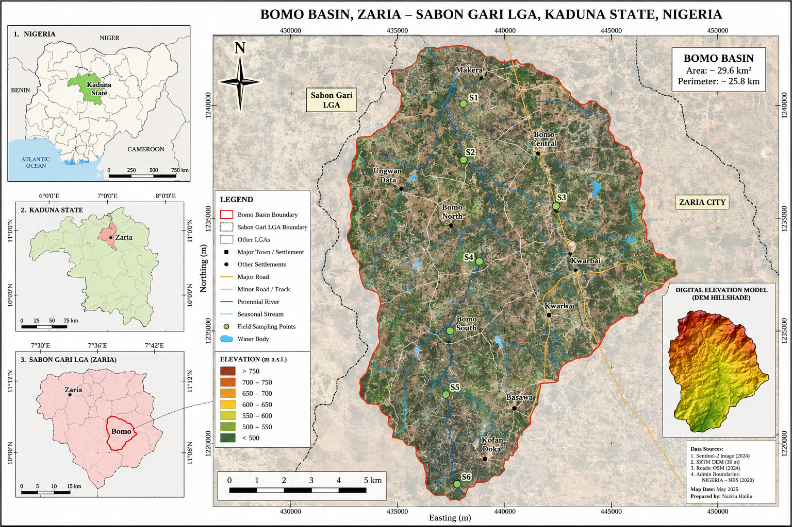
**Figure 1** — Location and topographic setting of the Bomo Basin study area,
Sabon Gari LGA, Zaria.

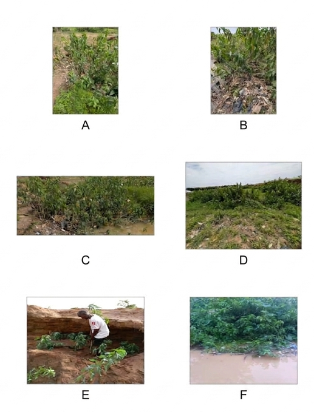
**Figure 2** — Field photographs of the Bomo Gully experimental reaches.

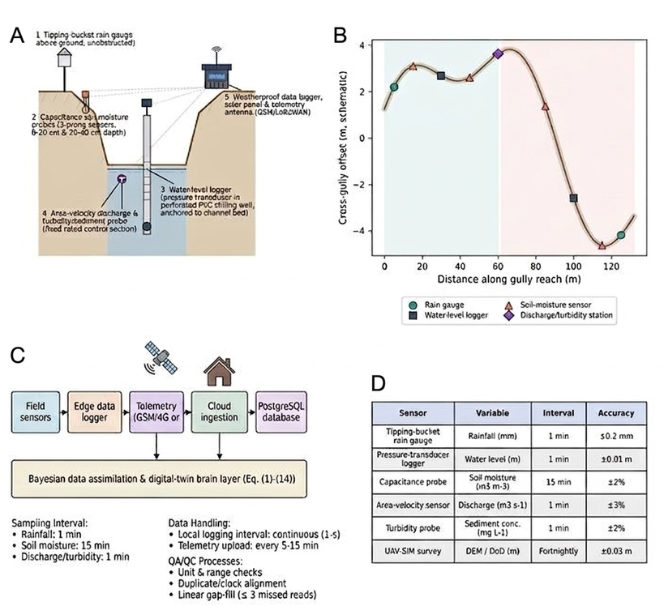
**Figure 3** — Sensor installation and data-recording architecture.

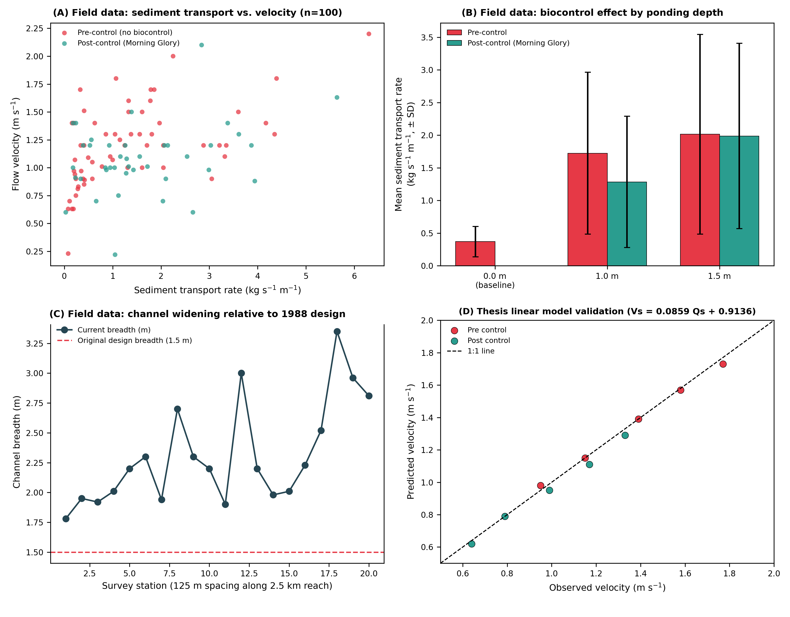
**Figure 4** — Real field-measured validation dataset.

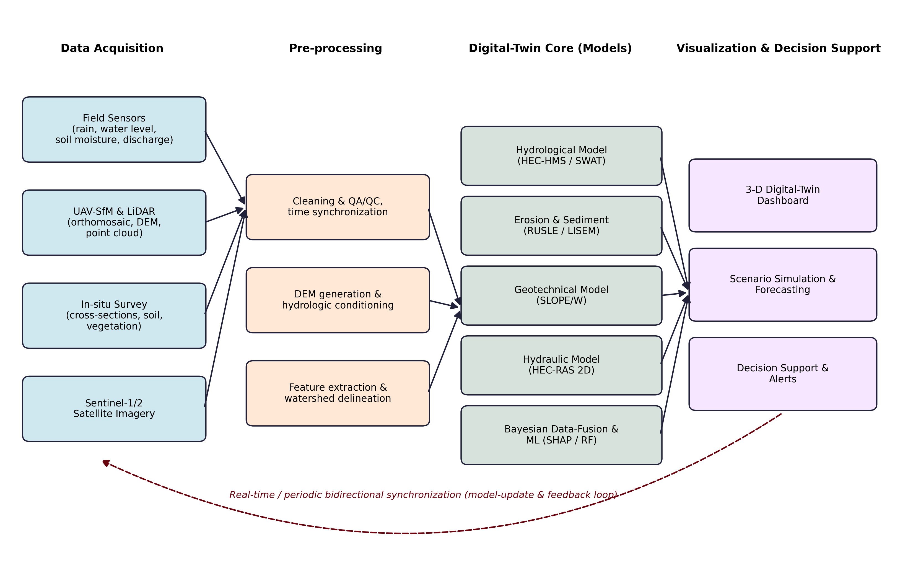
**Figure 5** — Digital-twin architecture and data pipeline.

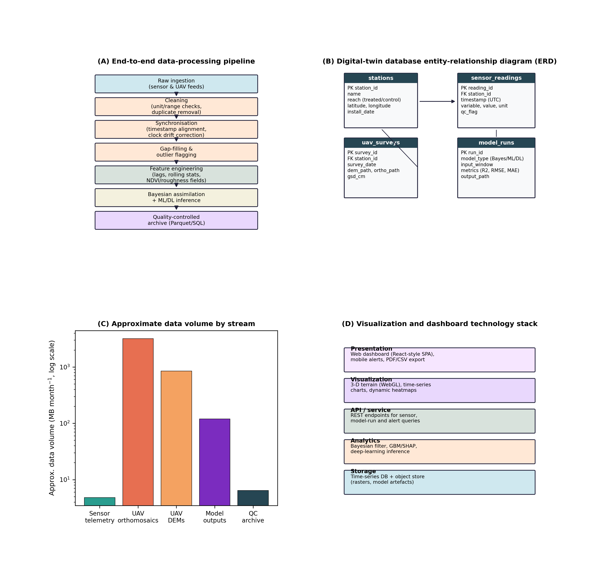
**Figure 6** — Data processing, storage, and visualization architecture.

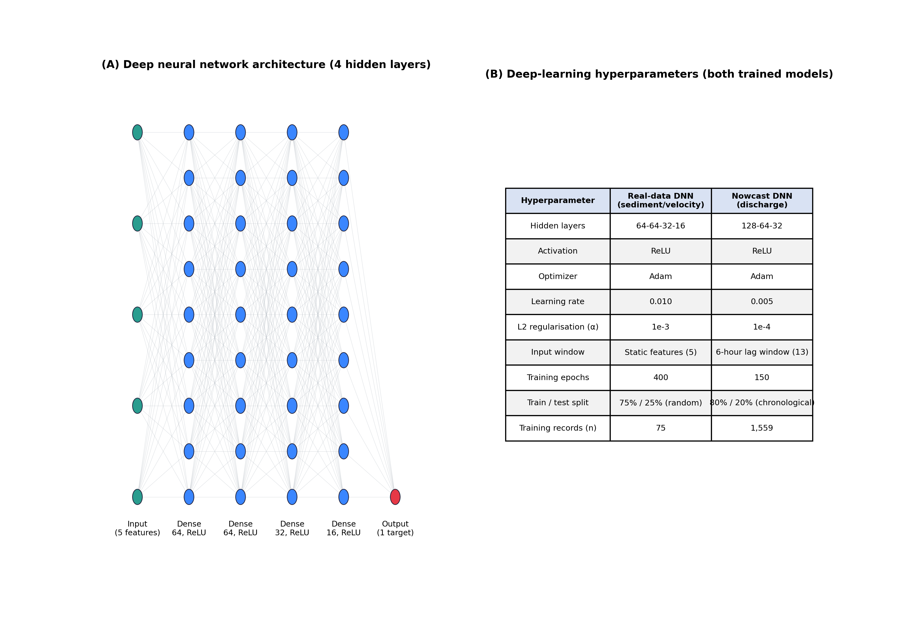
**Figure 7** — Deep-learning model architecture.

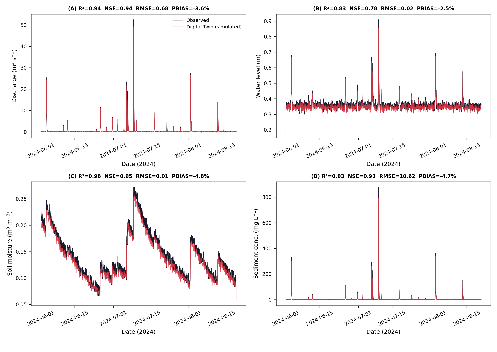
**Figure 8** — Digital-twin state estimation: observed versus simulated.

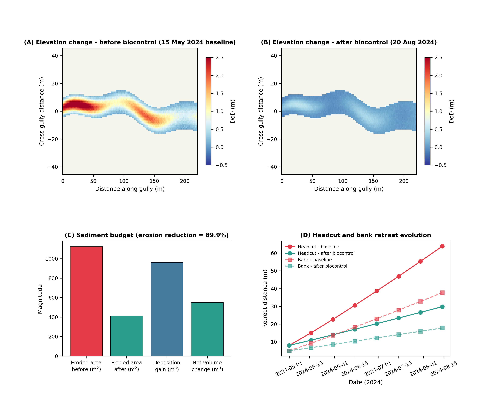
**Figure 9** — UAV-SfM DEM-of-Difference and sediment budget.

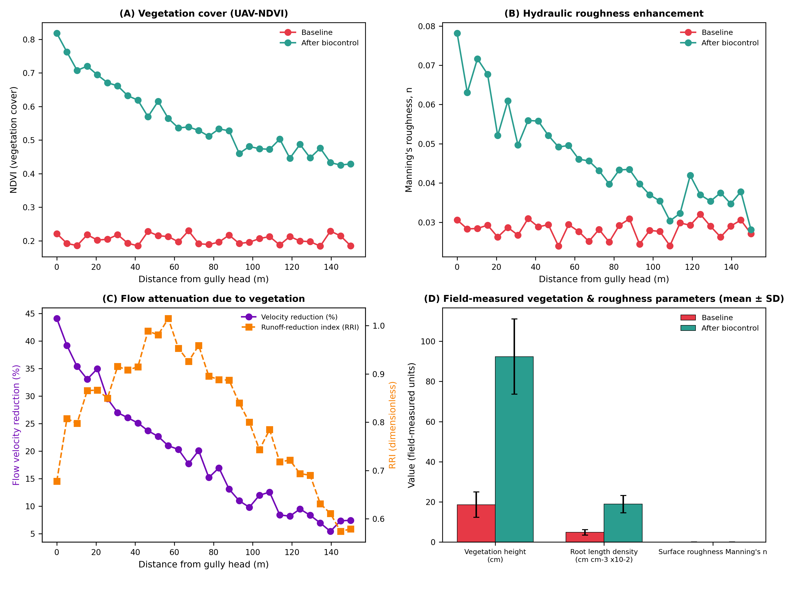
**Figure 10** — Biocontrol effectiveness of Morning Glory.

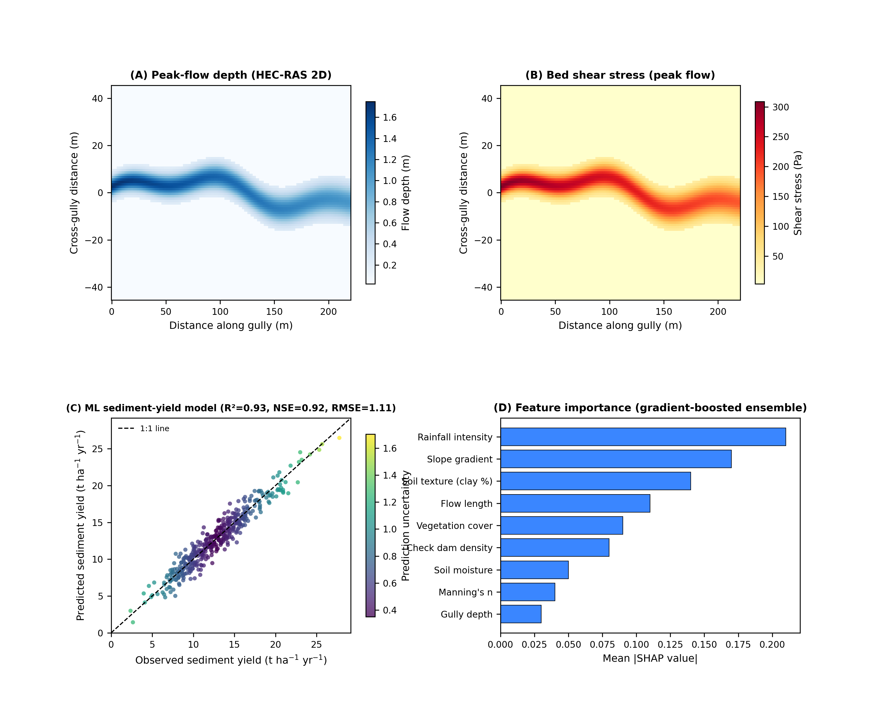
**Figure 11** — Peak-flow depth and bed shear stress from the hydraulic model.

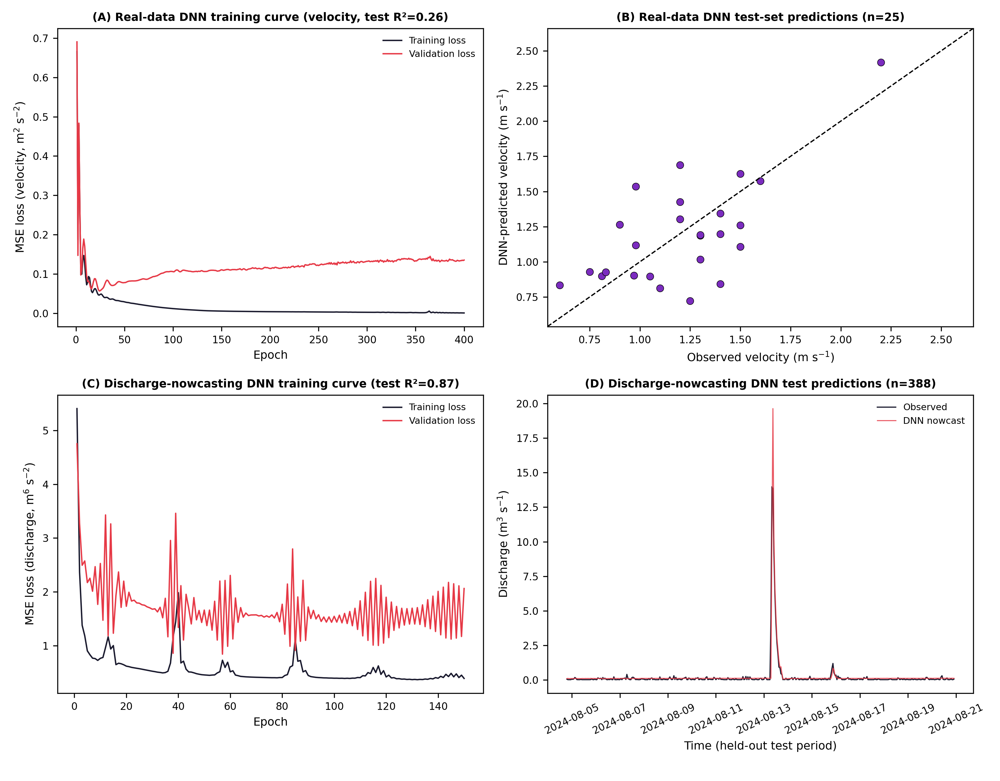
**Figure 12** — Deep-learning model training and performance.

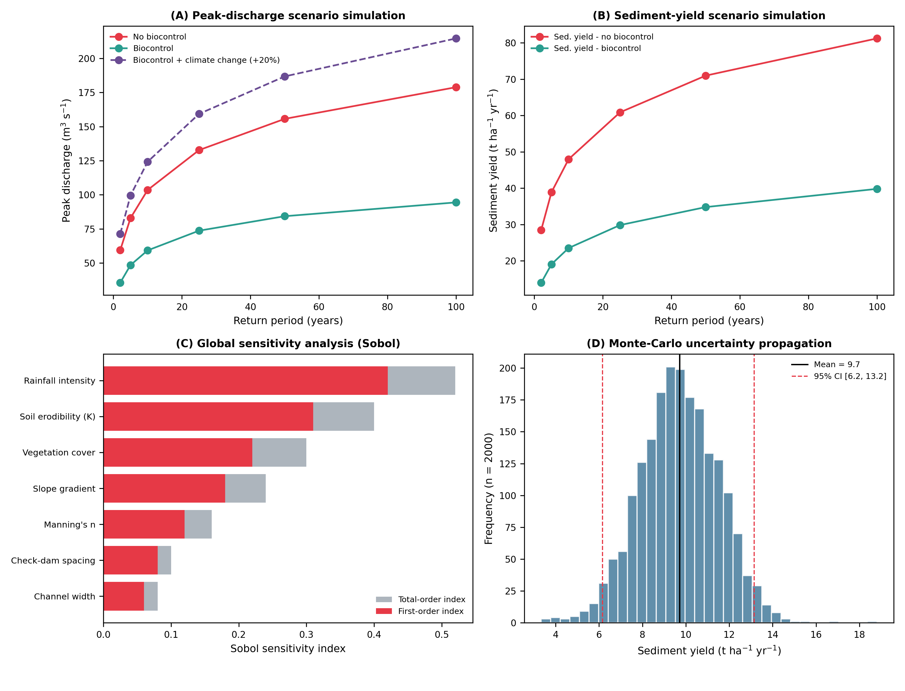
**Figure 13** — Peak-discharge and sediment-yield scenario simulation.

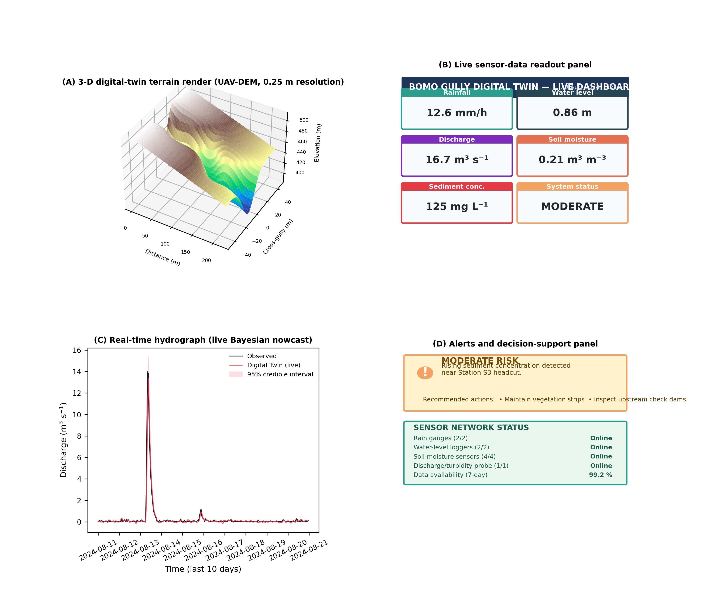
**Figure 14** — Digital-twin real-time dashboard and 3-D visualization.

### Supplementary Figure — Field Instrumentation and Sensor Array

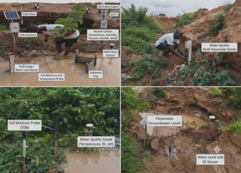

**Supplementary Figure** — Annotated photographs of the deployed field
instrumentation: solar panel, LoRa antenna, GNSS base stations, weather
station (temperature, humidity, pressure, rainfall, wind), staff gauge /
water level sensor, soil moisture and temperature probes (TDR), sediment
trap, water-quality multi-parameter sonde (temperature, EC, pH), piezometer
(groundwater level), and combined water-level/EC sensor — the physical
sensing layer feeding the digital-twin data pipeline shown schematically in
Figure 3.

## How to Run the Code

### 1. Clone the repository

```bash
git clone https://github.com/halilunaziru73-creator/Digital-Twin-for-the-Evaluation-of-Experimental-Gully-Biocontrol-Using-Morning-Glory-Ipomoea-spp.git
cd Digital-Twin-for-the-Evaluation-of-Experimental-Gully-Biocontrol-Using-Morning-Glory-Ipomoea-spp
```

### 2. Install dependencies

```bash
pip install numpy pandas matplotlib pillow scikit-learn scipy joblib --break-system-packages
```

### 3. Reproducing the pipeline

Run the scripts in order from the repository root:

```bash

python3 02_Code/00_real_thesis_data.py            # -> 06_Data_Real_Field/*.csv
python3 02_Code/01b_statistical_tests.py          # -> statistical significance tests
python3 02_Code/01_generate_data.py               # -> 03_Data/*.csv
python3 02_Code/02_generate_figures.py            # -> 04_Figures/*.png
python3 02_Code/03_train_deep_learning_model.py   # -> 07_Trained_Models/, model results
python3 02_Code/04_train_dl_nowcasting_model.py    # -> 07_Trained_Models/, nowcast results
```

## Loading a trained model

```python
import joblib, numpy as np

model = joblib.load("07_Trained_Models/dnn_velocity.joblib")
scaler = joblib.load("07_Trained_Models/scaler_X.joblib")

# feature order: water_depth_m, slope_decimal, soil_shear_lb_ft2, biocontrol, ponding_depth_m
X_new = scaler.transform(np.array([[0.9, 0.01, 0.6, 1, 1.0]]))
print(model.predict(X_new))
```

## Key findings

Paired statistical testing on real field data shows that Morning Glory
establishment produces a highly significant reduction in flow velocity at both
1.0 m and 1.5 m ponding depths (p < 0.001). The reduction in sediment transport is
significant at 1.0 m ponding (p = 0.004) but not at 1.5 m ponding (p = 0.19),
indicating that Morning Glory alone may need to be paired with structural
measures under more severe hydraulic loading — a finding discussed in full in
the manuscript.

## License

Released under the [MIT License](./LICENSE).

## Author

Naziru Halilu, 2026.

## Citation

If you use this repository, please cite it using the metadata in
[`CITATION.cff`](./CITATION.cff) (GitHub renders a "Cite this repository"
button on the repo's main page, in the top-right "About" panel).

## Related work

Part of a broader body of research on GIS, remote sensing, and machine
learning for agronomic and environmental applications:

- [Geometry-Agnostic Contrastive Learning (GACL)](https://github.com/halilunaziru73-creator/Geometry-Agnostic-Contrastive-Learning-GACL)
- [Real-Time RGB Proxy Vegetation Indexing (N_GACL)](https://github.com/halilunaziru73-creator/Real-Time-RGB-Proxy-Vegetation-Indexing-and-Texture-Analysis-for-UAV-and-Handheld-Crop-Imagery)
- [GIS-Based Delineation for Livestock Slurry Application](https://github.com/halilunaziru73-creator/GIS-based_delineation_of_areas_suitable_for_livestock_slurry_application)
- [Hybrid CNN-BiLSTM-Attention for Sediment Transport](https://github.com/halilunaziru73-creator/Hybrid-CNN-BiLSTM-Attention-Sediment-Transport-Agricultural-Gully-System)
- [Operationalizing GIS and ML across Cropping Systems](https://github.com/halilunaziru73-creator/Operationalizing-GIS-and-Machine-Learning-across-Contrasting-Cropping-Systems)
- [Geospatial Data Analysis](https://github.com/halilunaziru73-creator/Geospatial-data-analysis)
